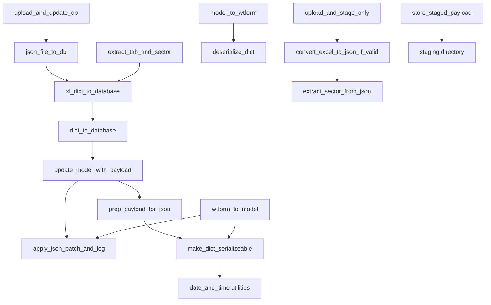

# Data Ingestion & Persistence Flow Analysis – July 2025 (Updated)

## Overview
This document summarizes the main functions responsible for ingesting, processing, and persisting data to the database in the ARB Feedback Portal. It includes a summary of each function, their interrelations, and a diagram to aid future refactoring efforts.

**Last Updated:** January 2025  
**Current Status:** Active development with recent improvements to datetime handling, staged upload workflow, and logging standardization.

---

## Main Data Ingestion, Processing, and Persistence Functions

### 1. `xl_dict_to_database`
- **Location:** `utils/db_ingest_util.py`
- **Purpose:** Converts a parsed Excel payload (as a dict) into a DB insert/update or staging operation.
- **How it works:** Extracts the relevant tab from the Excel dict, adds sector info, and then calls `dict_to_database` to perform the actual DB operation.
- **Interrelation:** **Delegates to `dict_to_database`** for the core DB logic.
- **Current Usage:** Used in direct uploads (`upload_file`) and staged upload confirmations (`apply_staged_update`).

### 2. `dict_to_database`
- **Location:** `utils/db_ingest_util.py`
- **Purpose:** Inserts or updates a row in the specified table using a dictionary payload.
- **How it works:** 
  - Resolves or creates the target row (using the primary key, usually `id_incidence`).
  - Calls `update_model_with_payload` to apply the payload to the model (including the JSON column).
  - Commits the change to the DB.
- **Interrelation:** 
  - **Called by `xl_dict_to_database`, `json_file_to_db`, and route-level functions.**
  - **Calls `update_model_with_payload`** for the actual model update.
- **Current Usage:** Used in dummy data creation routes (`og_incidence_create`, `landfill_incidence_create`) and staged upload confirmations.

### 3. `json_file_to_db`
- **Location:** `utils/db_ingest_util.py`
- **Purpose:** Loads a structured JSON file and inserts/updates the DB.
- **How it works:** Loads the JSON, then calls `xl_dict_to_database` to process and persist it.
- **Interrelation:** **Delegates to `xl_dict_to_database`**, which in turn calls `dict_to_database`.
- **Current Usage:** Used in `upload_and_update_db` for direct file uploads.

### 4. `update_model_with_payload`
- **Location:** `utils/wtf_forms_util.py`
- **Purpose:** Applies a JSON-safe payload to a model's JSON column and marks it as changed.
- **How it works:** 
  - Prepares the payload for JSON serialization (`prep_payload_for_json`).
  - Updates the model's JSON field.
  - Calls `apply_json_patch_and_log` to track and log changes.
- **Interrelation:** 
  - **Called by `dict_to_database`** and possibly other update flows.
  - **Calls `prep_payload_for_json`** and `apply_json_patch_and_log`.
- **Recent Changes:** Now uses `copy.deepcopy` to avoid side effects and improved error handling.

### 5. `prep_payload_for_json`
- **Location:** `utils/wtf_forms_util.py`
- **Purpose:** Prepares a payload dictionary for JSON-safe serialization (e.g., datetimes to ISO, decimals to float).
- **How it works:** Applies type coercion and serialization rules to the payload.
- **Interrelation:** **Called by `update_model_with_payload`**.
- **Recent Changes:** Now delegates to `make_dict_serializeable` with improved type mapping support.

### 6. `apply_json_patch_and_log`
- **Location:** `portal/json_update_util.py`
- **Purpose:** Applies updates to a model's JSON field and logs each change in an audit table.
- **How it works:** 
  - Compares current vs. new values in the JSON field.
  - Updates the field and logs meaningful changes.
  - Removes `id_incidence` from updates to avoid contaminating `misc_json`.
- **Interrelation:** **Called by `update_model_with_payload`**.
- **Recent Changes:** Enhanced logging and diagnostics, improved session management, and better error handling.

---

## Additional Key Functions: WTForm & JSON Helpers

### WTForm Population/Extraction

#### `model_to_wtform`
- **Purpose:** Populates a WTForm from a SQLAlchemy model's JSON column (`misc_json`).
- **How it works:** Loads the JSON, deserializes values (including datetimes), and sets WTForm field `.data` and `.raw_data` for correct rendering and validation.
- **Interrelation:** Used when displaying/editing existing records in the UI.
- **Recent Changes:** Improved datetime handling using new utility functions.

#### `wtform_to_model`
- **Purpose:** Extracts data from a WTForm and updates the model's JSON column, logging all changes.
- **How it works:** Serializes WTForm data, compares with existing JSON, and applies/logs only changed fields.
- **Interrelation:** Used when saving form submissions back to the database.
- **Recent Changes:** Enhanced type mapping support and improved error handling.

#### `get_payloads` (Deprecated)
- **Purpose:** Extracts all field values and changed values from a WTForm for comparison.
- **Interrelation:** Superseded by `wtform_to_model`.

### JSON Serialization/Deserialization

#### `make_dict_serializeable`
- **Purpose:** Ensures a dictionary is JSON-compatible (e.g., datetimes to ISO, decimals to float).
- **Interrelation:** Used in form/model serialization and staging.
- **Recent Changes:** Now uses centralized datetime utilities from `utils/date_and_time.py`.

#### `deserialize_dict`
- **Purpose:** Deserializes a dictionary, casting values to expected types (e.g., ISO strings to datetime).
- **Interrelation:** Used in form/model deserialization and population.
- **Recent Changes:** Enhanced type casting and improved error handling.

### Excel/JSON Helpers

#### `extract_tab_and_sector`
- **Purpose:** Extracts form data and sector info from Excel-parsed JSON for DB insertion.
- **Interrelation:** Used in Excel ingestion and staging.
- **Recent Changes:** Improved error handling for missing sectors and tabs.

#### `extract_sector_from_json`
- **Purpose:** Extracts the sector name from a JSON file generated from Excel.
- **Interrelation:** Used in file ingestion and validation.

---

## New Functions and Recent Additions

### Staged Upload Workflow
- **`upload_and_stage_only`**: New function for staging uploads without committing to DB.
- **`store_staged_payload`**: Saves parsed JSON payloads to staging directory.
- **`convert_excel_to_json_if_valid`**: Enhanced file conversion with better error handling.

### Enhanced Upload Functions
- **`upload_and_update_db`**: Current production upload function with improved diagnostics.
- **`upload_and_update_db_old`**: Deprecated version maintained for reference.

### Improved Diagnostics
- **Import audit generation**: Added to upload functions for better tracking.
- **Enhanced logging**: Comprehensive logging throughout the ingestion flow.
- **Better Error Reporting**: Improved user feedback for upload failures.

---

## Interrelation Diagram (Updated)

- **Direct Upload Flow:** `upload_and_update_db` → `json_file_to_db` → `xl_dict_to_database` → `dict_to_database` → `update_model_with_payload`
- **Staged Upload Flow:** `upload_and_stage_only` → `convert_excel_to_json_if_valid` → staging → `xl_dict_to_database` (on confirmation)
- **Form Handling:** `model_to_wtform` → `deserialize_dict` / `wtform_to_model` → `make_dict_serializeable` → `apply_json_patch_and_log`

---

## Summary Table (Updated)

| Function                | Main Role                                 | Interrelation/Notes                        | Recent Changes |
|-------------------------|-------------------------------------------|--------------------------------------------|----------------|
| xl_dict_to_database     | Excel dict → DB insert/update             | Calls `dict_to_database`                   | Enhanced error handling |
| dict_to_database        | Dict → DB row insert/update               | Calls `update_model_with_payload`          | Improved session management |
| json_file_to_db         | JSON file → DB insert/update              | Calls `xl_dict_to_database`                | Better metadata handling |
| update_model_with_payload | Apply payload to model's JSON column    | Calls `prep_payload_for_json`, `apply_json_patch_and_log` | Deep copy protection |
| prep_payload_for_json   | Prepare dict for JSON serialization       | Called by `update_model_with_payload`      | Delegates to `make_dict_serializeable` |
| apply_json_patch_and_log| Patch JSON, log changes                   | Called by `update_model_with_payload`, `wtform_to_model` | Enhanced diagnostics |
| model_to_wtform         | Populate WTForm from model JSON           | Uses `deserialize_dict`                    | Improved datetime handling |
| wtform_to_model         | Extract WTForm data to model JSON         | Uses `make_dict_serializeable`, logs changes | Enhanced type mapping |
| get_payloads (deprecated)| Extract all/changed WTForm values        | Superseded by `wtform_to_model`            | No changes |
| make_dict_serializeable | Ensure dict is JSON-serializable          | Used in serialization/staging              | Centralized datetime handling |
| deserialize_dict        | Cast dict values to expected types        | Used in deserialization/population         | Improved type casting |
| extract_tab_and_sector  | Extract form data/sector from Excel JSON  | Used in Excel ingestion/staging            | Better error handling |
| extract_sector_from_json| Extract sector from JSON file             | Used in file ingestion/validation          | No changes |
| upload_and_stage_only   | Stage uploads without DB commit           | New function for staged workflow           | New addition |
| store_staged_payload    | Save JSON payloads to staging             | Used in staged upload workflow             | New addition |

---

## Recent Improvements and Current State

### Datetime Handling Refactor (PR #22)
- **Centralized Utilities**: All datetime operations now use `utils/date_and_time.py`
- **Contract Compliance**: Strict UTC/ISO 8601 storage, naive California local for forms
- **Enhanced Serialization**: `make_dict_serializeable` and `deserialize_dict` use new utilities

### Staged Upload Workflow (PR #21, #26)
- **New Workflow**: Upload → Stage → Review → Confirm → Apply
- **Simplified Confirmation**: Explicit confirmation required for staged changes
- **Better UX**: Enhanced UI for staged file review and confirmation

### Logging Standardization (PR #21)
- **Standard Python Logging**: Replaced custom logger with `logging.getLogger(__name__)`
- **Enhanced Diagnostics**: Comprehensive logging throughout ingestion flow
- **Better Error Reporting**: Improved user feedback and debugging information

### Test Coverage
- **Comprehensive Tests**: `tests/arb/portal/test_utils_db_ingest_util.py` covers all main functions
- **Edge Cases**: Tests for error conditions, missing data, and invalid inputs
- **Integration Tests**: End-to-end testing of upload and staging workflows

---

## Conclusion
- The ingestion and persistence flow has been **significantly improved** with recent refactoring.
- **Datetime handling is now centralized and contract-compliant**.
- **Staged upload workflow provides better user control** over data changes.
- **Enhanced logging and diagnostics** improve debugging and user feedback.
- **Comprehensive test coverage** ensures reliability and maintainability.
- **A comprehensive refactor** could still clarify responsibilities and decouple JSON/DB column handling, but the current state is much more robust than the original analysis indicated. 