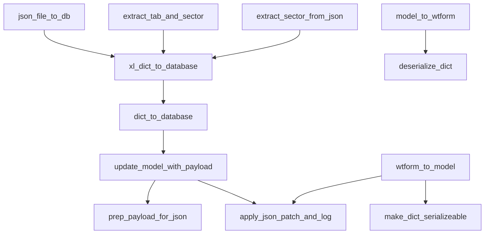

# Data Ingestion & Persistence Flow Analysis – July 2025

## Overview
This document summarizes the main functions responsible for ingesting, processing, and persisting data to the database in the ARB Feedback Portal. It includes a summary of each function, their interrelations, and a diagram to aid future refactoring efforts.

---

## Main Data Ingestion, Processing, and Persistence Functions

### 1. `xl_dict_to_database`
- **Location:** `utils/db_ingest_util.py`
- **Purpose:** Converts a parsed Excel payload (as a dict) into a DB insert/update or staging operation.
- **How it works:** Extracts the relevant tab from the Excel dict, adds sector info, and then calls `dict_to_database` to perform the actual DB operation.
- **Interrelation:** **Delegates to `dict_to_database`** for the core DB logic.

### 2. `dict_to_database`
- **Location:** `utils/db_ingest_util.py`
- **Purpose:** Inserts or updates a row in the specified table using a dictionary payload.
- **How it works:** 
  - Resolves or creates the target row (using the primary key, usually `id_incidence`).
  - Calls `update_model_with_payload` to apply the payload to the model (including the JSON column).
  - Commits the change to the DB.
- **Interrelation:** 
  - **Called by `xl_dict_to_database`, `json_file_to_db`, and possibly other ingestion points.**
  - **Calls `update_model_with_payload`** for the actual model update.

### 3. `json_file_to_db`
- **Location:** `utils/db_ingest_util.py`
- **Purpose:** Loads a structured JSON file and inserts/updates the DB.
- **How it works:** Loads the JSON, then calls `xl_dict_to_database` to process and persist it.
- **Interrelation:** **Delegates to `xl_dict_to_database`**, which in turn calls `dict_to_database`.

### 4. `update_model_with_payload`
- **Location:** `utils/wtf_forms_util.py`
- **Purpose:** Applies a JSON-safe payload to a model's JSON column and marks it as changed.
- **How it works:** 
  - Prepares the payload for JSON serialization (`prep_payload_for_json`).
  - Updates the model's JSON field.
  - Calls `apply_json_patch_and_log` to track and log changes.
- **Interrelation:** 
  - **Called by `dict_to_database`** and possibly other update flows.
  - **Calls `prep_payload_for_json`** and `apply_json_patch_and_log`.

### 5. `prep_payload_for_json`
- **Location:** `utils/wtf_forms_util.py`
- **Purpose:** Prepares a payload dictionary for JSON-safe serialization (e.g., datetimes to ISO, decimals to float).
- **How it works:** Applies type coercion and serialization rules to the payload.
- **Interrelation:** **Called by `update_model_with_payload`**.

### 6. `apply_json_patch_and_log`
- **Location:** `portal/json_update_util.py`
- **Purpose:** Applies updates to a model's JSON field and logs each change in an audit table.
- **How it works:** 
  - Compares current vs. new values in the JSON field.
  - Updates the field and logs meaningful changes.
  - Removes `id_incidence` from updates to avoid contaminating `misc_json`.
- **Interrelation:** **Called by `update_model_with_payload`**.

---

## Additional Key Functions: WTForm & JSON Helpers

### WTForm Population/Extraction

#### `model_to_wtform`
- **Purpose:** Populates a WTForm from a SQLAlchemy model's JSON column (`misc_json`).
- **How it works:** Loads the JSON, deserializes values (including datetimes), and sets WTForm field `.data` and `.raw_data` for correct rendering and validation.
- **Interrelation:** Used when displaying/editing existing records in the UI.

#### `wtform_to_model`
- **Purpose:** Extracts data from a WTForm and updates the model's JSON column, logging all changes.
- **How it works:** Serializes WTForm data, compares with existing JSON, and applies/logs only changed fields.
- **Interrelation:** Used when saving form submissions back to the database.

#### `get_payloads` (Deprecated)
- **Purpose:** Extracts all field values and changed values from a WTForm for comparison.
- **Interrelation:** Superseded by `wtform_to_model`.

### JSON Serialization/Deserialization

#### `make_dict_serializeable`
- **Purpose:** Ensures a dictionary is JSON-compatible (e.g., datetimes to ISO, decimals to float).
- **Interrelation:** Used in form/model serialization and staging.

#### `deserialize_dict`
- **Purpose:** Deserializes a dictionary, casting values to expected types (e.g., ISO strings to datetime).
- **Interrelation:** Used in form/model deserialization and population.

### Excel/JSON Helpers

#### `extract_tab_and_sector`
- **Purpose:** Extracts form data and sector info from Excel-parsed JSON for DB insertion.
- **Interrelation:** Used in Excel ingestion and staging.

#### `extract_sector_from_json`
- **Purpose:** Extracts the sector name from a JSON file generated from Excel.
- **Interrelation:** Used in file ingestion and validation.

---

## Interrelation Diagram

- **`json_file_to_db`** → **`xl_dict_to_database`** → **`dict_to_database`** → **`update_model_with_payload`** → **`prep_payload_for_json`** and **`apply_json_patch_and_log`**
- **`model_to_wtform`** → **`deserialize_dict`**
- **`wtform_to_model`** → **`make_dict_serializeable`** and **`apply_json_patch_and_log`**
- **`extract_tab_and_sector`** and **`extract_sector_from_json`** feed into Excel/JSON ingestion

---

## Summary Table

| Function                | Main Role                                 | Interrelation/Notes                        |
|-------------------------|-------------------------------------------|--------------------------------------------|
| xl_dict_to_database     | Excel dict → DB insert/update             | Calls `dict_to_database`                   |
| dict_to_database        | Dict → DB row insert/update               | Calls `update_model_with_payload`          |
| json_file_to_db         | JSON file → DB insert/update              | Calls `xl_dict_to_database`                |
| update_model_with_payload | Apply payload to model's JSON column    | Calls `prep_payload_for_json`, `apply_json_patch_and_log` |
| prep_payload_for_json   | Prepare dict for JSON serialization       | Called by `update_model_with_payload`      |
| apply_json_patch_and_log| Patch JSON, log changes                   | Called by `update_model_with_payload`, `wtform_to_model` |
| model_to_wtform         | Populate WTForm from model JSON           | Uses `deserialize_dict`                    |
| wtform_to_model         | Extract WTForm data to model JSON         | Uses `make_dict_serializeable`, logs changes |
| get_payloads (deprecated)| Extract all/changed WTForm values        | Superseded by `wtform_to_model`            |
| make_dict_serializeable | Ensure dict is JSON-serializable          | Used in serialization/staging              |
| deserialize_dict        | Cast dict values to expected types        | Used in deserialization/population         |
| extract_tab_and_sector  | Extract form data/sector from Excel JSON  | Used in Excel ingestion/staging            |
| extract_sector_from_json| Extract sector from JSON file             | Used in file ingestion/validation          |

---

## Conclusion
- The ingestion and persistence flow is **deeply nested and tightly coupled**.
- `id_incidence` is handled at multiple layers, with explicit logic to avoid contaminating `misc_json`.
- **A comprehensive refactor** could clarify responsibilities, decouple JSON and DB column handling, and simplify the flow. 